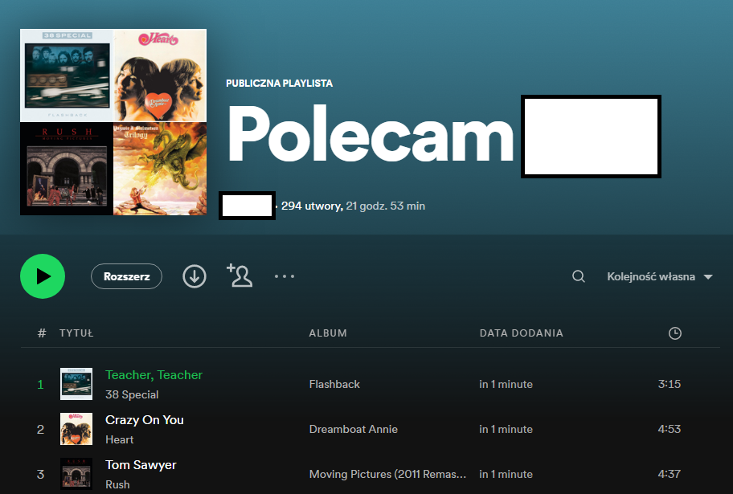

# Recommendify - Rekomendacje utworów muzycznych przy wykorzystaniu wybranego modelu klasyfikacji

Dokumentacja techniczna opisuje aplikację internetową napisaną w języku programowania Python. Jej zadaniem jest stworzenie playlisty z rekomendowanymi utworami odpowiadającymi ostatnim muzycznym preferencjom użytkownika.
Aplikacja korzysta z API Spotify, w celu skolekcjonowania z konta użytkownika listy ostatnich oraz najczęstszych wyborów muzycznych. Na podstawie tych utworów uczony jest model, który w końcowej fazie pomaga w rekomendacji ścieżek muzycznych o podobnych zależnościach.

 

## Prawa autorskie:

### Autorzy
- Zuzanna Aranowska
- Weronika Deleżuch
- Iga Gaca
- Joanna Obiedzińska


### Licencja

Utwór dostępny jest na licencji [Creative Commons Uznanie autorstwa-Użycie niekomercyjne-Na tych samych warunkach 4.0](https://creativecommons.org/licenses/by-nc-sa/4.0/legalcode.pl). 

### Specyfikacja wymagań

1. Skrypt łączący z API - pozwala na dostęp danych użytkownika [ Priorytet 1 ][ Backend ]
2. Skrypt przygotowujący dane - ekstrakcja i obróbka danych pod model uczenia maszynowego [ Priorytet 1 ][ Backend ]
3. Model uczenia maszynowego - klasyfikuje utwory muzyczne, które mogą spodobać się użytkownikowi [ Priorytet 1 ][ Backend ]
4. Aplikacja Flask - pozwala na pokazanie użytkownikowi, że playlista jest w trakcie tworzenia. [ Priorytet 2 ][ Frontend ]


## Architektura technologiczna

- Python
- html
- JavaScript 

- GitHub

 Biblioteki: 
- spotipy
- yaml
- pandas
- numpy
- matplotlib
- scikit-learn
- Flask

Informacje zastosowanych wersjach znajdują się w pliku [requirements.txt](https://github.com/zaranowska/IO/blob/main/requirements.txt). 


## Spotify Web API

W celu połączenia się aplikacji z danymi danego użytkownika oraz pobrania ich, wykorzystano Spotify API. Połączenie jest możliwe dzięki platformie Spotify for Delevopers, dostępne pod linkiem: https://developer.spotify.com/ 

Krokiem, który należy wykonać jest założenie aplikacji w zakladce “Dashboard”, która jest niezbędna do uzyskania unikatowego Client ID oraz Client Secret, które umożliwiają uzyskanie połączenia API ze stworzoną aplikacją. 

Każdy zarejestrowany użytkownik Spotify ma możliwość zalogowania sie do opcji dla Developerów. W tym celu należy wejść w następujący link https://developer.spotify.com/dashboard/ .

Po zalogowaniu dostępna jest opcja “Create an App”, która umożliwia założenie projektu.

W celu efektywnego uzyskania danych ze Spotify Web API, użyta została biblioteka pythona - [Spotipy](https://github.com/spotipy-dev/spotipy), która umożliwia pełny pełny dostęp do wszystkich danych muzycznych dostarczanych przez platformę Spotify.


```ruby
import spotipy
from spotipy.oauth2 import SpotifyOAuth


client_id = "CLIENT_ID"
client_secret = "CLIENT_SECRET"
redirect_uri = "REDIRECT_URI"

scope = "user-library-read user-follow-read user-top-read playlist-read-private"

sp = spotipy.Spotify(auth_manager=SpotifyOAuth(
    client_id,
    client_secret,
    redirect_uri,
    scope=scope,
))
```


W miejscu client_id oraz client_secret należy pamiętać o wprowadzeniu kluczy z aplikacji założonej w Spotify for Developers. W redirect_uri należy wprowadzić adres strony, który umożliwi użytkownikowi zalogowanie się do aplikacji, np. “https://localhost:8008/callback”. 

W części testów znajduję się wykorzystanie Spotify Web API. 


## Testowanie aplikacji

### 1. Pobieranie danych ze Spotify API

Plik functions.py zawiera wszystkie potrzebne funkcje do pobrania potrzebnych danych: 
- offset_api_limit
- get_artists_df
- get_tracks_df
- get_track_audio_df
- get_all_playlist_tracks_df
- get_recommendations


Do stworzenia zbioru, który będzie posiadał rekordy na temat wyborów muzycznych użytkownika, zostaną wykorzystane informacje takie jak:

- Top 60 najczęściej słuchanych artystów

```ruby
top_artists = offset_api_limit(sp, sp.current_user_top_artists())
top_artists_df = get_artists_df(top_artists)
top_artists_df.to_pickle("top_artists.pkl")
```

- Obserwowani artyści

```ruby
followed_artists = offset_api_limit(sp, sp.current_user_followed_artists())
followed_artists_df = get_artists_df(followed_artists)
followed_artists_df.to_pickle("followed_artists.pkl")

```

- Top 60 słuchanych utworów 

```ruby
top_tracks = offset_api_limit(sp, sp.current_user_top_tracks())
top_tracks_df = get_tracks_df(top_tracks)
top_tracks_df = get_track_audio_df(sp, top_tracks_df)
top_tracks_df.to_pickle("top_tracks.pkl")
```

- Polubione utwory

```ruby
saved_tracks = offset_api_limit(sp, sp.current_user_saved_tracks())
saved_tracks_df = get_tracks_df(saved_tracks)
saved_tracks_df = get_track_audio_df(sp, saved_tracks_df)
saved_tracks_df.to_pickle("saved_tracks.pkl")
```

- Utwory z zapisanych/utworzonych playlist (do 50 playlist)

```ruby
playlist_tracks_df = get_all_playlist_tracks_df(sp, sp.current_user_playlists())  
playlist_tracks_df = get_track_audio_df(sp, playlist_tracks_df)
playlist_tracks_df.to_pickle("playlist_tracks.pkl")
```

W powyższym kodzie na początku zostają wykorzystane funkcję offset_api_limit oraz get_all_playlist_tracks_df, które pobierają wszystkie dostępne dane użytkownika, o które zostaje wysłane zapytanie do API. Kolejnie następuję stworzenie listy pozyskanych danych, które końcowo są przetransformowane i przetransportowane jako dataframe pliku o rozszerzeniu .pkl. 

- Rekomendowane utwory

```ruby
recommendation_tracks = get_recommendations(sp, playlist_tracks_df[playlist_tracks_df['playlist_name'].isin(
  "Your Top Songs 2022")].drop_duplicates(subset='id', keep="first")['id'].tolist())
recommendation_tracks_df = get_tracks_df(recommendation_tracks)
recommendation_tracks_df = get_track_audio_df(sp, recommendation_tracks_df)
recommendation_tracks_df.to_pickle("recommendation_tracks.pkl")
```

Pozyskanie listy rekomendowanych ścieżek muzycznych następuję analogicznie do wcześniejszych przykładów. Należy uwzględnić, że na każdy utwór przypada 20 rekomendacji i jest to odgórny limit nałożony przez API. 


### 2. Modele klasyfikacji

Użyty został algorytm Drzew Losowych (Random Forest) znajdujący się w pliku [modele.py](https://github.com/zaranowska/IO/blob/main/projekt0.2/modele.py). 

Zbiór danych zawierał 2071 prób, został on podzielony na zbiór treningowy i testowy w proporcjach 80:20.

Poniżej przedstawiono podstawowe miary dokładności dopasowania modelu. Jak widać wybrany model prezentuje się dość dobrze:

|               | Precyzja | Czułość | F1- Score |
| ------------- | ------------- | ------------- | ------------- |
|  0  | 0.9 | 0.86 | 0.88 |
|  1  | 0.93 | 0.95 | 0.94 |


###### Zmienne: 
- artist_name – wykonawca
- track_name – tytuł utworu
- track_id  - ID utworu
- popularity – popularność prezentowana w skali 0-100, gdzie 0 - niepopularny, a 100 -  popularny utwór
- danceability – opisuje taneczność utwóru w oparciu o kombinację elementów muzycznych, takich jak tempo, rytm oraz beat. Przyjmowane są wartości od 0,0 do 1,0. 
- energy - miara intensywności i energetyczności piosenki. Przyjmuje wartości od 0,0 do 1,0. Energetyczne utwory odczuwane są jako szybkie oraz głośne. 
- key - tonacja utworu. Liczby całkowite odwzorowują dzwięki przy użyciu standardowej notacji, np.. 0 = C, 1 = C#, 2 = D. 
- loudness -  głośność utworu mierzona w decybelach (dB). Wartości głośności są uśredniane dla całej ścieżki.
- mode - wskazuje tendencje tonalną utworu - dur lub moll.  Dur(major) jest reprezentowany przez 1, a moll(minor) przez 0.
- speechiness - wykrywa obecność wypowiadanych słów w utworze. Im bardziej nagranie przypomina wyłącznie mowę (np. talk show, audiobook, poezja), tym wartość jest bliższa 1,0.
- acousticness - miara od 0,0 do 1,0 określająca, czy utwór jest akustyczny. 
- instrumentalness - przewiduje, czy ścieżka nie zawiera wokali. Wokalizy „Ooh” i „Aah” traktowane są jako instument. Im wartość bliższa 1,0, tym większe prawdopodobieństwo, że utwór nie zawiera treści wokalnych. 
- liveness - wykrywa obecność publiczności w nagraniu. Wyższe wartości oznaczają zwiększone prawdopodobieństwo, że utwór był wykonywany na żywo. 
- valence - miara od 0,0 do 1,0. Utwory o wysokiej brzmią bardziej pozytywnie (np. radosne, wesołe, euforyczne), podczas gdy utwory o niskiej wartościowości brzmią bardziej negatywnie (np. smutne, melancholijne, wściekłe).
- tempo - szacunkowe tempo, szybkość utworu w uderzeniach na minutę (BPM). 
- duration_ms - czas trwania ścieżki w milisekundach.
- time_signature - metrum, rytm utworu. Schemat określający układ akcentów w obrębie taktu oraz sposób zapisu wartości rytmicznych.


### 3. Aplikacja lokalnie 
Uruchomienie aplikacji lokalnie następuje poprzez skrypt []() : 

Przekierowuje nas on do następującej strony: 


Po uzyskaniu dostępu należy kliknąć “Zaczynamy”, który przekieruje nas do witryny, w której musimy potwierdzić zgode na udostępnienie danych dotyczących konta użytkownika aplikacji Spotify:


Po wyrażeniu zgody, strona przekieruje nas bezpośrednio do aplikacji Spotify, w której będzie czekała gotowa playlista z rekomendacjami utworów:


### 4. Aplikacja globalnie


## Ograniczenia aplikacji oraz jej dalszy rozwój 

Jednym z ograniczeń aplikacji jest powolny proces pobierania danych ze Spotify Web API.  W kolejnych etapach można byłoby rozważyć ulepszenie rozwiązań, które pozwoliłyby na lepsze oraz szybsze funkcjonowanie aplikacji.

Kolejnym krokiem byłoby dopisanie kodu tak, by aplikacja mogła działać globalnie i być dostępna dla większej ilości użytkowników. Wersji rozwojowa daje możliwość udostępnienia jej maksymalnie dla 25 kont, więc niezbędne byłoby wnioskowanie do Spotify o zwiększenie puli osób, które mogą korzystać z aplikacji.

Aktualnie działanie aplikacji pozwala na stworzenie pojedynczej playlisty z rekomendacjami na podstawie ostatnich wyborów muzycznych. W przyszłości można poszerzyć pomysł o dodatkowe funkcje takie jak możliwość wyboru kilku playlist pod kątem bieżącego nastroju. 


